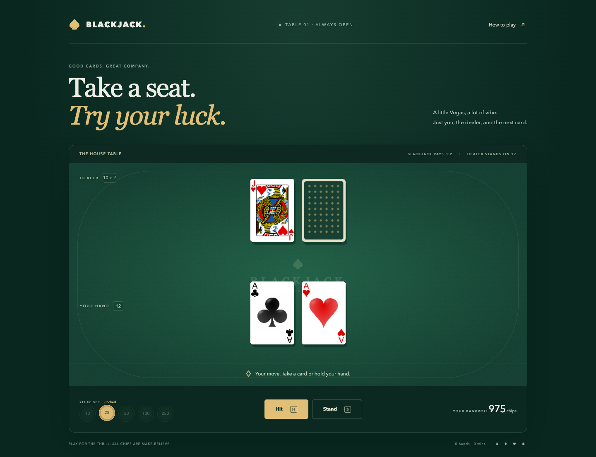
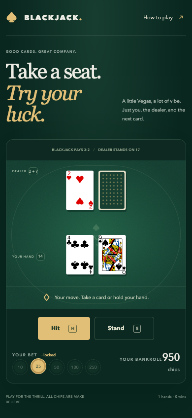
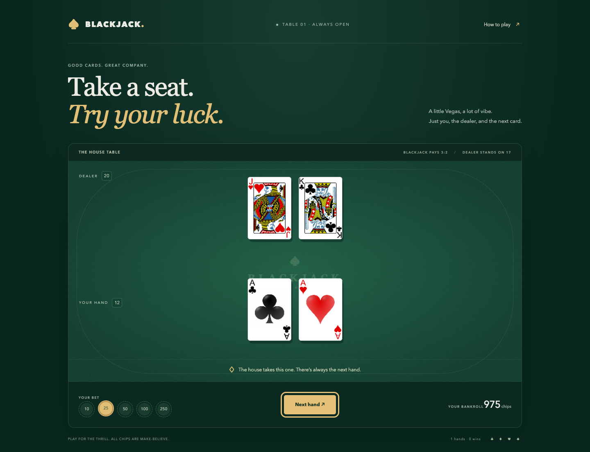

# ♠ Blackjack — Take a seat.

**A little Vegas, a lot of vibe.** Just you, the dealer, and the next card.

A browser blackjack game with deep green felt, gold chips, and a tiny house edge on your afternoon productivity. Built with TypeScript and PixiJS. No account, no real money — just chase 21.



## Deal yourself in

Use **Node.js 22.12+** (or 20.19+) and npm.

```sh
git clone git@github.com:leracherry/black-jack.git
cd black-jack
npm ci
npm start
```

Open **http://localhost:8000**. Pick your chips, hit **Deal me in**, and make your move.

## The house rules

- Start with **1,000 pretend chips**. Choose a bet of 10, 25, 50, 100, or 250.
- **Hit** to draw another card; **Stand** to keep your hand. Keyboard shortcuts: **H** and **S**.
- Get closer to **21** than the dealer without going over. Aces count as 1 or 11; face cards count as 10.
- The dealer draws to 17 and **stands on soft 17**. Reaching 21 automatically stands your hand.
- A regular win pays **1:1**, a two-card blackjack pays **3:2**, and a tie returns the **entire stake**. Both natural blackjacks tie.
- Your bet locks when the cards are dealt. Every hand uses a freshly shuffled 52-card deck.
- No splitting, doubling, or insurance. Run out of chips? **Fresh start** is on the house.

The bankroll stays in the current session. Refreshing resets it. All chips are make-believe.

## Small screen, same table

HTML buttons, visible focus states, keyboard shortcuts, live score announcements, and a rules dialog keep the controls usable beyond the canvas. The card table adjusts to smaller screens.



<details>
<summary>See a finished hand</summary>



</details>

## Work on the game

| Command                | What it does                                          |
| ---------------------- | ----------------------------------------------------- |
| `npm start`            | Start the local development server                    |
| `npm test`             | Run scoring, game flow, and bankroll regression tests |
| `npm run typecheck`    | Check TypeScript without generating files             |
| `npm run build`        | Type-check and build the production site into `dist/` |
| `npm run preview`      | Serve the production build locally                    |
| `npm run format`       | Format the source and docs                            |
| `npm run format:check` | Check formatting without changing files               |

The stack is deliberately small: **PixiJS** draws the cards, **TypeScript** keeps the rules explicit, **Vite** handles development and builds, **Vitest** checks the game logic, and **Prettier** keeps things tidy.

```text
src/
  cards.ts       # Typed cards, Fisher–Yates shuffle, ace-aware scoring
  game.ts        # Hand lifecycle, wager locking, outcomes, payouts
  table.ts       # PixiJS card renderer and responsive canvas
  index.ts       # HTML controls, announcements, keyboard input
public/
  assets/cards/  # Original card artwork
style.css        # Felt, chips, typography, responsive layouts
tests/           # Game-rule regression tests
docs/screenshots/# Real desktop, mobile, and finished-hand captures
```

Game rules stay separate from rendering, so you can test a hand without a browser or change the table without changing payouts. GitHub Actions runs formatting, tests, and the production build on pushes and pull requests.

## Put it on a table of your own

Run `npm run build` and deploy `dist/` to a static host. For a subdirectory such as GitHub Pages, build with the matching base path:

```sh
npm run build -- --base=/black-jack/
```

Serve the built files over HTTP rather than opening `index.html` directly. Card artwork is included locally; the game has no external font or CDN dependency.
